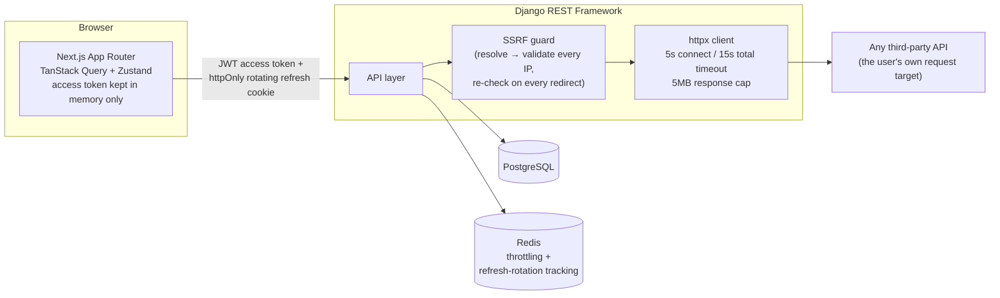

# API Forge

A Postman-inspired API testing platform, built from scratch as a full-stack portfolio project: a Next.js/TypeScript frontend and a Django REST Framework backend, with real security engineering behind the parts that matter — SSRF-protected outbound request execution, JWT auth with rotation-reuse detection, and secret redaction in stored history.

See [`progress.md`](./progress.md) for the phase-by-phase build log — what was planned vs. what actually shipped, including bugs found by live verification and how they were fixed.

## Features

- **Request builder** — method, URL, query params, headers, body (JSON/raw/form-urlencoded/multipart), and auth (Bearer/Basic/API Key), with `{{variable}}` substitution throughout
- **Response viewer** — status/time/size, a collapsible JSON tree, headers table, and distinct error states for timeouts, DNS failures, blocked targets, and oversized responses
- **Collections with nested subfolders** — organize saved requests into arbitrarily deep folders, reorganize by dragging a request or a whole folder directly onto another (or use the equivalent Move dialogs)
- **Environments** — per-owner variable sets with one active at a time, secret values masked everywhere except the actual outbound request
- **Request history** — every execution logged automatically (redacted), filterable, restorable back into the builder
- **Request chaining** — extract a value from a response (e.g. a login token) into an environment variable, which auto-applies on every future send
- **Test assertions** — structured, `eval()`-free checks (status code, response time, header/JSON-field conditions, body substring) that run after every send, with PASS/FAIL and actual-vs-expected shown per assertion
- **Dashboard** — resource counts, recent activity, and a test pass-rate rollup, all live on every visit
- **Interactive API docs** — the backend documents its own API via Swagger UI (`/api/docs/`)

## Architecture



Every outbound request the tool makes on a user's behalf goes through the SSRF guard first: the hostname is resolved, every resolved IP is checked against a blocklist (loopback, RFC1918 private ranges, link-local including the `169.254.169.254` cloud-metadata address, multicast, unspecified), and that check re-runs on every redirect hop — so a hostname that *looks* public but resolves to an internal address is blocked exactly the same as an internal address typed directly, and a redirect can't be used to smuggle the request past the same check afterward.

## Tech stack

| | |
|---|---|
| **Frontend** | Next.js 16 (App Router), TypeScript, Tailwind CSS v4, TanStack Query, Zustand, `@dnd-kit/core`, CodeMirror 6 |
| **Backend** | Django 5, Django REST Framework, PostgreSQL, `httpx`, `djangorestframework-simplejwt`, `drf-spectacular` |
| **Auth** | JWT — short-lived access token in memory (never localStorage), refresh token as an httpOnly/Secure/SameSite=Lax cookie scoped to `/api/auth/`, rotation with cache-backed reuse detection |
| **Infra** | Docker Compose (frontend, backend, PostgreSQL, Redis); Redis backs DRF throttling and refresh-token rotation tracking, falling back to an in-process cache for native dev with no Redis running |
| **Testing** | `pytest-django` (203 backend tests), Vitest + React Testing Library (51 frontend tests), `ruff` (lint/format) |

## Running locally

### Docker (recommended)

```bash
cp backend/.env.example backend/.env   # fill in a real SECRET_KEY — this is the only env file Docker Compose needs
docker compose up --build
```

- Frontend: http://localhost:3000
- Backend API: http://localhost:8000
- Interactive API docs: http://localhost:8000/api/docs/

> **Note:** this project was built in an environment without Docker installed, so `docker compose up` itself hasn't been run end-to-end — every service's config (`Dockerfile`s, `docker-compose.yml`, `.dockerignore`s, env wiring) has been reviewed carefully and each piece works when run natively, but please treat the very first Docker run as something to verify rather than assume.

### Native (without Docker)

**Backend** — see [`backend/README.md`](./backend/README.md) for full steps: create a virtualenv, `pip install -r requirements/dev.txt`, copy `.env.example` → `.env`, create the Postgres database, `python manage.py migrate`, `python manage.py runserver`.

**Frontend** — see [`frontend/README.md`](./frontend/README.md): `npm install`, copy `.env.example` → `.env.local`, `npm run dev`.

Both need to run simultaneously (Postgres running natively too, in this mode).

## API reference

The full, always-current reference is generated from the code itself — run the backend and open `/api/docs/` (Swagger UI) or fetch the raw OpenAPI schema at `/api/schema/`. Summary:

| Area | Endpoints |
|---|---|
| Auth | `POST /api/auth/{register,login,refresh,logout}/`, `GET /api/auth/me/` |
| Ad-hoc execution | `POST /api/execute/` |
| Collections (nestable) | `GET/POST /api/collections/`, `GET/PATCH/DELETE /api/collections/{id}/` |
| Saved requests | `GET/POST /api/collections/{id}/requests/`, `GET/PATCH/DELETE /api/requests/{id}/`, `POST /api/requests/{id}/move/`, `POST /api/requests/{id}/execute/` |
| Environments | `GET/POST /api/environments/`, `GET/PATCH/DELETE /api/environments/{id}/`, `POST /api/environments/{id}/activate/`, `POST /api/environments/deactivate/`, `GET/POST /api/environments/{id}/variables/`, `PATCH/DELETE /api/environments/{id}/variables/{id}/` |
| History | `GET /api/history/`, `GET/DELETE /api/history/{id}/`, `DELETE /api/history/clear/` |
| Test assertions | `GET/POST /api/requests/{id}/tests/`, `PATCH/DELETE /api/tests/{id}/` |
| Dashboard | `GET /api/dashboard/summary/` |

Every list/detail endpoint is scoped to the authenticated caller; accessing another user's resource by id returns **404, not 403** — queryset filtering means a non-owner's request can't distinguish "doesn't exist" from "exists but isn't yours."

## Security notes

- **SSRF protection** (`apps/core/ssrf.py`, `apps/core/http_client.py`) — see the Architecture section above. Only `http`/`https` schemes are allowed; everything else (`file://`, etc.) is rejected outright.
- **No `eval()` anywhere** — `{{variable}}` substitution and every test assertion type are plain, bounded comparisons over parsed data, never dynamic code execution. A dotted-path extractor (`token`, `data.access_token`, `items.0.id`) is shared by request chaining and JSON-field assertions — deliberately not full JSONPath, to keep the syntax's behavior easy to reason about.
- **JWT handling** — the access token lives in memory only (a page reload always re-derives it from a silent refresh call, never from localStorage); the refresh token is an httpOnly cookie the frontend JS can't read, scoped to `/api/auth/` so it's never sent on unrelated calls; refresh rotation is tracked in the cache (Redis in Docker/prod) with reuse detection — replaying an already-rotated refresh token revokes the session.
- **Secret redaction** — `Authorization`-style headers and `auth_config` fields (token/password/API key) are masked before being written to stored history, *unless* the value is an unresolved `{{variable}}` template, in which case it's stored as-is (there's nothing to leak — the real secret was never in that field to begin with). This distinction was a real bug caught during manual testing, not something the original design got right on the first pass — see the Phase 6 entry in `progress.md`.
- **Throttling** — DRF `ScopedRateThrottle` on auth endpoints (brute-force protection) and on execute endpoints (abuse/open-proxy protection), both Redis-backed and configurable via env vars.
- **Response size cap** — outbound responses are read with a 5MB cap and aborted early past that, so the tool can't be used to pull down arbitrarily large responses through the server.

## Testing

```bash
# Backend
cd backend && pytest

# Frontend
cd frontend && npm run test
```

203 backend tests cover: full auth flows (including refresh-rotation reuse detection), CRUD + cross-user isolation for every resource, SSRF blocklist behavior (including a simulated DNS-rebinding case — a hostname that resolves to a private IP is blocked the same as typing the IP directly), variable resolution, extraction rules, every assertion type, and the dashboard summary aggregation. 51 frontend tests cover the pure utility functions (JSON-path extraction, collection tree building, assertion description, formatting), key interactive components (the JSON tree viewer, the key/value param-and-header editor), the auth store, and the API client's silent-refresh-on-401 logic specifically (attaches the token, refreshes and retries once on a stale token, propagates the failure when refresh also fails, and never attempts a refresh for calls explicitly marked to skip auth).

## Future improvements

Documented honestly rather than left implicit — things a v2 would tackle:

- **Real file uploads** — multipart bodies are forwarded live but not persisted as binary blobs in a saved request; re-attach the file when replaying one.
- **A full sequential Collection Runner** — today, chaining N requests means running them in order yourself (extraction rules auto-apply, but nothing drives the sequence for you).
- **More auth types** — OAuth2 flows, Digest auth, AWS Signature v4, and "inherit auth from parent folder" aren't implemented; Bearer/Basic/API Key cover the common cases.
- **A real deployment** — this build covers local dev (Docker Compose) and documents a path (e.g. Vercel for the frontend + Render/Railway for the backend + managed Postgres/Redis) but doesn't provision one.
- **Full JSONPath** — the dotted-path syntax used for both chaining and assertions is deliberately minimal; a richer syntax (wildcards, filters) is a natural extension once the simple case is solid.

## What this project demonstrates

- Designed and built a full-stack application end to end — Next.js/TypeScript frontend, Django REST Framework backend, PostgreSQL, JWT auth with refresh rotation — across 10 planned phases plus real mid-project feature additions (nested collection folders, drag-and-drop reorganization), each shipped with passing tests and a working app before moving on.
- Implemented SSRF protection from first principles: resolved-IP validation (not hostname string matching) re-checked on every redirect hop, defending against both direct access to internal/cloud-metadata addresses and DNS-rebinding-style attacks — verified with a dedicated test simulating a "looks public, resolves private" hostname.
- Built a constrained, `eval()`-free expression system (variable substitution + test assertions) shared across two features via one dotted-path extractor, favoring a small well-tested surface over a general-purpose interpreter.
- Caught and fixed two security-relevant bugs that the automated test suite alone did not surface — a permission check that worked for real foreign keys but not computed ownership properties, and a redaction routine that masked variable *references* as if they were the secrets themselves — both found through deliberate live end-to-end verification, not assumed away.
- Wrote 203 backend tests and 51 frontend tests (`pytest-django`, Vitest + React Testing Library) covering auth, cross-user data isolation, SSRF edge cases, and the frontend's own silent-token-refresh logic; documented the full OpenAPI schema via `drf-spectacular`.
